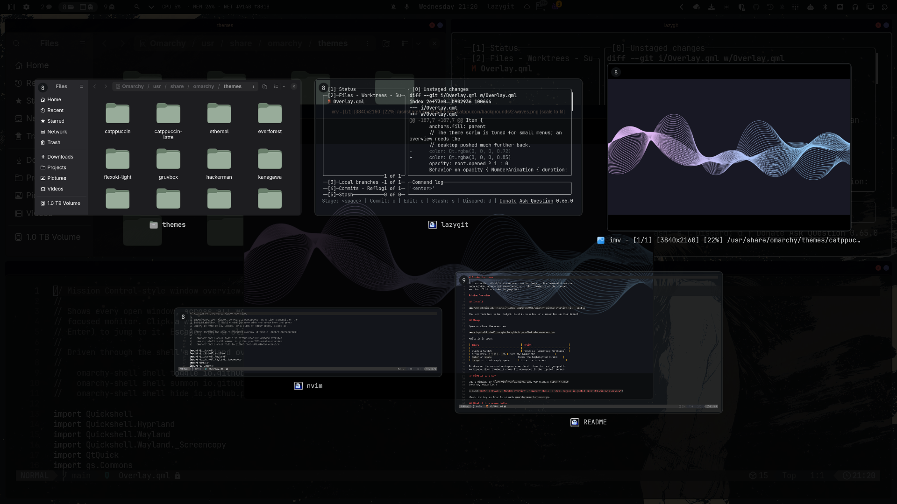

# Window Overview

A Mission Control-style window overview for Omarchy. One command shows every
open window, across all workspaces, as a live thumbnail on the focused
monitor. Click a window to jump to it.



## Install

```sh
omarchy plugin add https://github.com/proof001/omarchy-window-overview.git --enable
```

The overview has no bar widget. Bind it to a key or a mouse button (see below).

## Usage

Open or close the overview:

```sh
omarchy-shell shell toggle io.github.proof001.window-overview
```

While it is open:

| Input                              | Action                          |
|------------------------------------|---------------------------------|
| Click a window                     | Focus it (switching workspace)  |
| Arrow keys, `h` `j` `k` `l`, `Tab` | Move the highlight              |
| `Enter` or `Space`                 | Focus the highlighted window    |
| `Escape` or click empty space      | Close the overview              |

Windows on the current workspace come first, then the rest grouped by
workspace. Each thumbnail shows its workspace in the top-left corner.

## Bind it to a key

Add a binding to `~/.config/hypr/bindings.lua`, for example `Super + Grave`
(the key above Tab):

```lua
o.bind("SUPER + GRAVE", "Window overview", "omarchy-shell -q shell toggle io.github.proof001.window-overview")
```

Check the key is free first with `omarchy menu keybindings`.

## Bind it to a mouse button

Any tool that can run a shell command on a button press works. For example,
with [OpenLogi](https://github.com/AprilNEA/OpenLogi) on a Logitech mouse, set a
button to *Run shell command* with:

```sh
omarchy-shell -q shell toggle io.github.proof001.window-overview
```

## Requirements

- Omarchy with the Quattro shell (Hyprland + Quickshell)
- Live thumbnails use Hyprland's toplevel export protocol, which ships with
  Hyprland. No extra packages are needed.

The plugin runs no external commands. It reads windows from Hyprland and
focuses the one you pick through Hyprland's dispatcher.

## Remove

```sh
omarchy plugin remove io.github.proof001.window-overview
```

If you added a key binding or mouse binding, remove that too.

## License

[MIT](LICENSE). `friendlyAppName()` and `appIcon()` are adapted from
[omarchy-altswitch](https://github.com/Pablo-Merino/omarchy-altswitch)
by Pablo Merino (MIT).
